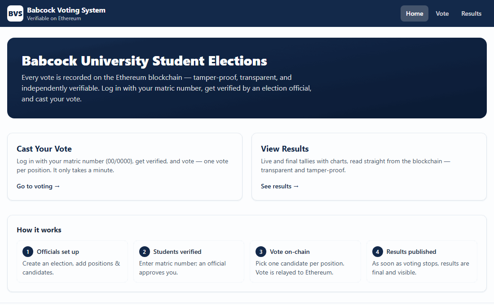
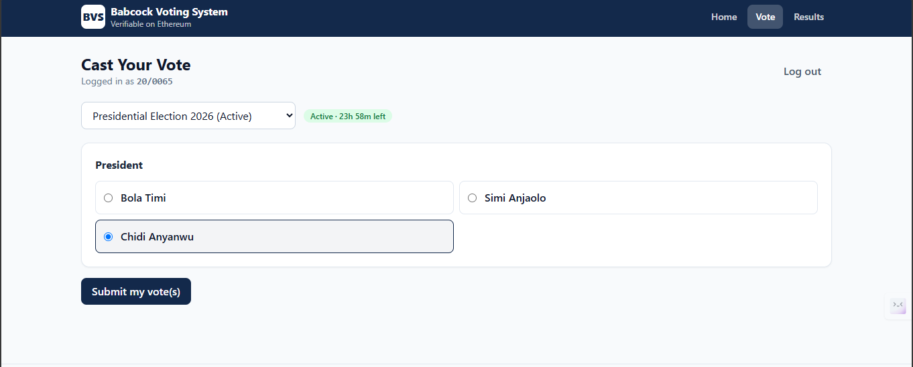
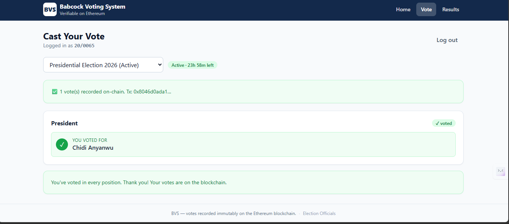
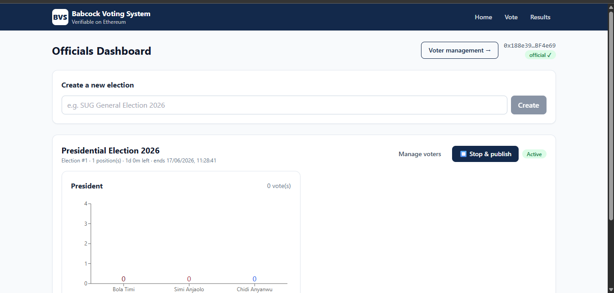
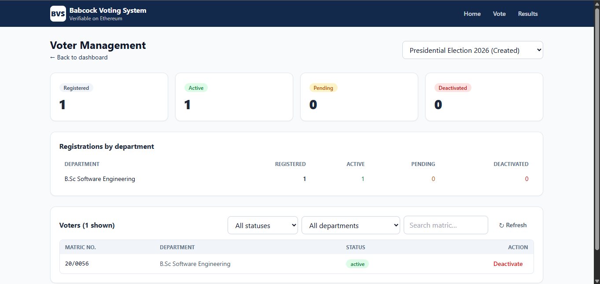
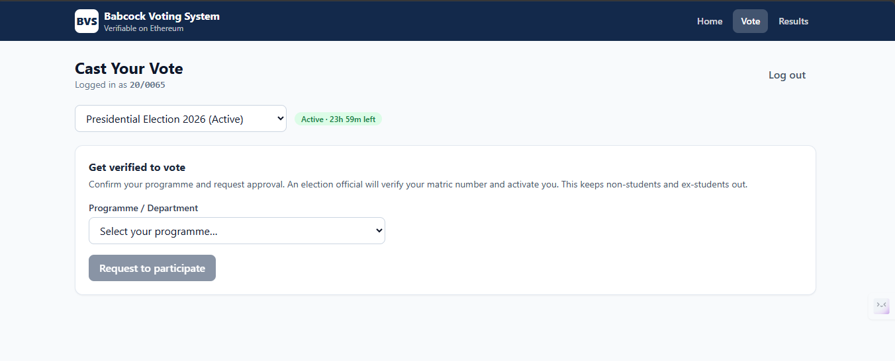
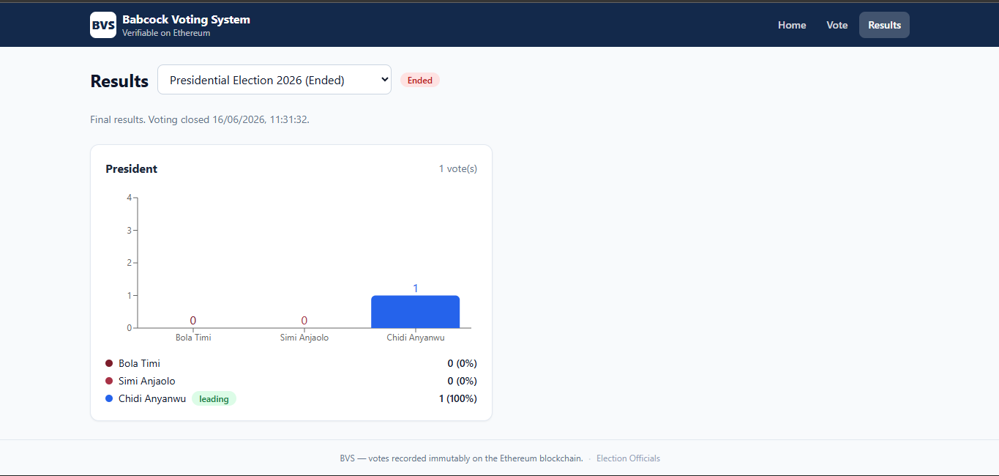

# BVS — Babcock Voting System

An **Ethereum e-voting dApp** for Babcock University student-official elections. Every vote is
recorded **on-chain** — tamper-proof, transparent, and independently verifiable. Students log in
with their matric number (`00/0000`), an election official verifies & approves them, and they cast
**one vote per position** (e.g. one for President, one for Vice President).

> Built with Solidity + Hardhat, a Node/Express relayer, and a React + Vite frontend.

---

## 🎬 Demo



*A student logs in with their matric number, gets verified, casts a vote, and sees exactly who they
voted for — every vote recorded on-chain.*

---

## ✨ Features

**For students**
- Log in with matric number (`00/0000`) — no crypto wallet or gas required.
- Pick your programme/department and request to participate.
- Vote once per position; after voting you see **exactly who you voted for** (stored on-chain).

**For election officials**
- Create elections, add positions and candidates.
- Set a **voting duration** (1 hour → 1 week) and **manually start/stop**.
- A dedicated **Voter Management** page: registrations broken down **by department**, with
  **Active / Pending / Deactivated** categories and one-click **activate/deactivate**.
- Live results with charts; results are final the moment voting stops.

**On-chain guarantees (enforced by the smart contract)**
- Only officials can configure elections; config locks once voting starts.
- Only **approved** voters can vote (blocks non-students / ex-students).
- **One vote per (election, position, voter)** — no double voting.
- Votes, approvals, and lifecycle changes all emit events for independent verification.

**Built to scale**
- Votes are **batched** (a whole ballot = one transaction).
- A **relayer pool** with per-account nonce management submits votes in parallel.
- Results load in a **single contract call** (`getResults`), and the backend derives voter
  categories from **events** (no per-voter RPC), so thousands of registrants stay fast.

---

## 📸 Screenshots

| Cast your vote | After voting |
|---|---|
|  |  |

| Officials dashboard | Voter management |
|---|---|
|  |  |

| Get verified (student) | Results |
|---|---|
|  |  |

## 🏗️ Architecture

```
                      ┌──────────────────────────────┐
  Officials (MetaMask)│  React + Vite frontend         │ Students (matric login)
        ▲             │  (officials dashboard +        │        ▲
        │ write txs   │   voter mgmt + voting UI)      │        │ HTTP
        │ create/start/stop/approve   └──────┬─────────┘        │
        ▼                          read       ▼                  ▼
   ┌──────────────────────────────────────┐        ┌────────────────────────────┐
   │        Ethereum (Ganache / L2)        │◄───────│  Express backend             │
   │  BVS.sol — elections, votes, tally    │ relay  │  matric auth + relayer pool  │
   └──────────────────────────────────────┘  vote  └────────────────────────────┘
```

- **`contracts/`** — Solidity (`BVS.sol`) + Hardhat. Deploys to Ganache; writes the address + ABI
  to `shared/BVS.json`.
- **`backend/`** — Express API. Validates matric format, tracks participation requests, and
  **relays** student votes on-chain so students need no wallet or ETH.
- **`frontend/`** — React + Vite + TailwindCSS + Recharts. Officials use MetaMask; students log in
  with their matric number.
- **`shared/BVS.json`** — generated on deploy; the contract address + ABI consumed by both backend
  and frontend.

The matric number itself is **never stored on-chain** — only its `keccak256` hash.

---

## ✅ Prerequisites

| Tool | Notes |
|------|-------|
| **Node.js 18+** | `node -v` |
| **Git** | to clone the repo |
| **Ganache** | [GUI](https://archive.trufflesuite.com/ganache/) (RPC on `:7545`) or `npm i -g ganache` (CLI on `:8545`) |
| **MetaMask** | browser extension, for the officials' wallet |

### Installing the prerequisites

**macOS** (with [Homebrew](https://brew.sh)):
```bash
brew install node            # Node.js + npm
npm install -g ganache       # Ganache CLI (RPC on :8545) — or download the GUI (RPC on :7545)
# Git is pre-installed, or run: xcode-select --install
# MetaMask: add the extension from https://metamask.io
```

**Windows** (with [winget](https://learn.microsoft.com/windows/package-manager/)):
```powershell
winget install --id OpenJS.NodeJS -e
winget install --id Git.Git -e
# Ganache: download the GUI installer (RPC on :7545), or `npm i -g ganache`
# MetaMask: add the extension from https://metamask.io
```

> **Port note:** the Ganache **GUI** serves RPC on `:7545`; the **CLI** uses `:8545`. Use whichever
> matches your setup consistently across the three `.env` files and MetaMask. The examples below
> assume `:7545`.

---

## 🚀 Setup

### 1. Clone & install

```bash
git clone https://github.com/<your-username>/Blockchain-Voting-System.git
cd Blockchain-Voting-System
npm run install:all
```

### 2. Start Ganache

Open Ganache (Quickstart) and note the **RPC SERVER** URL (e.g. `http://127.0.0.1:7545`). Pick
**two accounts** from the Accounts tab:
- **Account #0** → Official / Deployer (you'll import this into MetaMask)
- **Account #1+** → Relayer pool (the backend votes through these; no keys needed for Ganache)

### 3. Create the env files

```bash
# Windows PowerShell
Copy-Item contracts\.env.example contracts\.env
Copy-Item backend\.env.example   backend\.env
Copy-Item frontend\.env.example  frontend\.env

# macOS/Linux
cp contracts/.env.example contracts/.env
cp backend/.env.example   backend/.env
cp frontend/.env.example  frontend/.env
```

Then set the RPC URL in each file to match your Ganache (default assumes `:7545`):

| File | Key | Value |
|------|-----|-------|
| `contracts/.env` | `GANACHE_RPC` | `http://127.0.0.1:7545` |
| | `DEPLOYER_PRIVATE_KEY` | *(blank → uses Ganache's unlocked account #0)* |
| | `RELAYER_POOL_SIZE` | `4` (accounts #1–#4 become the relayer pool) |
| `backend/.env` | `GANACHE_RPC` | same RPC |
| | `RELAYER_PRIVATE_KEY` | *(blank → signs through Ganache's unlocked relayer)* |
| `frontend/.env` | `VITE_GANACHE_RPC` | same RPC |
| | `VITE_API_URL` | `http://127.0.0.1:4000` |

> On Ganache the relayer accounts are **unlocked**, so no private keys are needed. For a public
> testnet, set `DEPLOYER_PRIVATE_KEY` and `RELAYER_PRIVATE_KEY` to real funded keys.

### 4. Connect MetaMask to Ganache

1. MetaMask → networks → **Add a custom network**:
   - **Network name:** `Ganache`
   - **RPC URL:** `http://127.0.0.1:7545`
   - **Chain ID:** `1337` ⚠️ (Ganache's *chain ID* is `1337` even though its *network ID* shows `5777`)
   - **Currency symbol:** `ETH`
2. Switch to the **Ganache** network.
3. **Import Account #0**: account menu → *Import account* → paste Account #0's private key.

---

## ▶️ Run

```bash
npm run deploy      # 1. deploy contract -> writes shared/BVS.json
npm run backend     # 2. start relayer + API on :4000
npm run frontend    # 3. start the UI on :5173 (opens automatically)
```

Open **http://localhost:5173**.

---

## 🗳️ Usage

**Officials** (via the footer "Election Officials" link → `/admin`)
1. Connect MetaMask (should show `official ✓`).
2. Create an election → add positions (President, Vice President) → add candidates.
3. Choose a duration → **Start election**.
4. **Voter management** → review registrations (by department) → **Activate** voters.
5. **Stop & publish** (or let the timer expire) to finalize results.

**Students** (Vote tab)
1. Log in with matric number (e.g. `19/0001`) → select your programme → **Request to participate**.
2. Once an official activates you, pick one candidate per position → **Submit**.
3. See **"You voted for …"** per position. Re-voting a position is blocked.

**Anyone** → the **Results** page shows live and final tallies with charts.

---

## 🔍 Verifying on-chain

Votes/approvals/lifecycle changes emit events (`VoteCast`, `VoterApproved`, `VoterRevoked`,
`ElectionStarted`, `ElectionEnded`). Inspect them in Ganache's **Transactions / Events** tabs, or
query the contract's public mappings (`approved`, `votedFor`, `votedCandidate`) and `getResults`
from any client. On a public testnet, the same data is viewable on a block explorer (e.g. Etherscan).

---

## 🧪 Tests

```bash
npm run test:contracts
```

Covers officials-only config, config-lock on start, the approval gate, one-vote-per-position,
revoke/reactivate, batched `castVotes`, single-call `getResults`, relayer authorization, manual
stop, duration auto-expiry, and post-end approval block.

---

## 🛠️ Troubleshooting

| Symptom | Fix |
|---|---|
| MetaMask: *"Chain ID returned … (1337)"* when adding the network | Set Chain ID to **`1337`** (not `5777`). |
| MetaMask shows **0 ETH** / `could not decode result data` / `BAD_DATA` | Ganache was restarted → fresh chain. Re-run `npm run deploy`, restart the backend, hard-refresh the browser. |
| Account has 0 ETH after import | You imported an account from a previous Ganache session. Import an account from the **current** Ganache, or use a saved Ganache workspace so accounts persist. |
| Frontend can't reach the chain | Confirm the RPC port (`7545` GUI / `8545` CLI) matches in all three `.env` files. |
| Want results on a public explorer | Etherscan can't see local Ganache — deploy to an L2/testnet for a public, verifiable link. |

> **Tip:** Ganache's Quickstart generates fresh accounts each launch (wiping deployed contracts).
> Click **SAVE** in Ganache to persist a workspace, then reopen it to keep the same accounts.

---

## 📈 Scaling notes (for production)

This runs great locally on Ganache. To host for thousands of concurrent voters:
- Deploy to an **L2** (Base, Arbitrum, Optimism, Polygon) for high throughput + sub-cent gas.
- Grow the **relayer pool** (20–50 funded accounts) and keep them topped up.
- Swap the in-memory request store for **Postgres**; serve results via a **cached endpoint**,
  **WebSockets**, or a **The Graph** subgraph instead of clients polling the chain directly.

---

## 📁 Project structure

```
Blockchain-Voting-System/
├── contracts/            # Solidity + Hardhat
│   ├── contracts/BVS.sol
│   ├── scripts/deploy.js  scripts/smoke.js
│   └── test/BVS.test.js
├── backend/              # Express relayer + matric auth API
│   └── src/{server,chain,store,matric}.js
├── frontend/             # React + Vite + Tailwind + Recharts
│   └── src/{pages,components,lib}/...
├── shared/BVS.json       # generated on deploy (address + ABI)
└── package.json          # root convenience scripts
```

---

## 📄 License

MIT — see [LICENSE](LICENSE).
